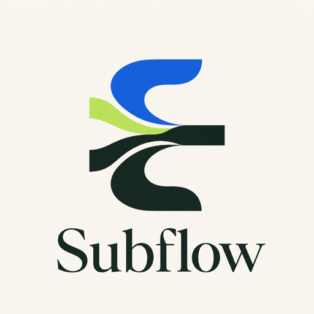

<p align="center">
  
</p>

# Subflow · 策略订阅发布器

把一条已授权的机场订阅转换为经过模板分析、Claude 路由定制和目标兼容性验证的 Clash / Mihomo 与 Surge 长期订阅。

## 核心能力

- 四步引导流程：导入订阅 → 确认双端模板 → 选择 Claude 出口 → 验证并发布。
- 双端模板推荐：使用内置确定性优先级分别推荐 Clash 与 Surge 模板，并允许手动更换。
- 模板保真转换：保留 provider URL、规则顺序、DNS/TUN 和非 Claude 策略。
- Profile 管理：一个 Profile 共享源订阅与 Claude 出口，分别保存 Clash、Surge 模板和产物。
- Token 保护：订阅和编辑均需要 Profile token；前端只将 token 保存在创建它的本机浏览器。
- 目标隔离缓存：订阅源或外部模板暂时不可用时，只回退到对应客户端的最后成功产物。
- 上下文检查器：按需查看节点、分析问题、流量模拟和最终源码。

## 当前范围

| 项目 | 当前行为 |
|---|---|
| 发布目标 | 统一界面固定同时发布 Clash / Mihomo 与 Surge，暂不支持只选其中一个目标 |
| 定制策略 | 当前聚焦 Claude 分流：复用专属组，或从共享 AI / OpenAI 组中拆出独立 Claude 组 |
| Surge 支持 | 仅开放规则图可完整编译的 Claude 模板；节点协议在发布前按实际订阅再次验证 |
| sing-box | 后端保留编译能力，但统一 Profile 流程暂不发布 sing-box 订阅 |

## 快速启动

### Docker

```bash
docker compose up
```

### 本地开发

需要 Python 3.12+ 和 [uv](https://docs.astral.sh/uv/)。

```bash
uv sync
uv run uvicorn app.main:app --reload
```

打开 [http://127.0.0.1:8000](http://127.0.0.1:8000)。`/advanced` 保留为兼容入口，展示同一个统一界面。

## 使用流程

### 1. 导入订阅

粘贴授权的机场订阅 URL。Subflow 先解析并展示节点数量，不会立即创建 Profile。

### 2. 确认模板组合

统一界面会同时准备两个目标，并按内置优先级给出默认模板：

| 目标 | 候选范围 | 发布前门禁 |
|---|---|---|
| Clash / Mihomo | 全部含 Claude 策略的模板 | 必须存在可识别的 Claude 子图 |
| Surge | Claude 规则图可完整编译的模板 | provider 格式和规则类型需兼容；实际订阅中的节点协议也必须可编译 |

推荐是确定性排序，不会判断节点质量或自动测速。点击“更换模板”可展开两个目标各自的候选下拉列表。

### 3. 指定 Claude 出口

选择一个已确认可稳定访问 Claude 的节点。转换行为：

- 模板已有 Claude 专属组：将出口置于成员首位。
- Claude 规则共用 AI/OpenAI 组：创建独立 Claude 组并以原目标作为回退。
- 不注入内置域名，不替换第三方规则源。

### 4. 验证并发布

发布前会构建 Clash 与 Surge 两份产物：Clash 通过 PolicyWorkspace 执行规则分析，Surge 通过模板、规则类型与节点协议编译门禁。任一目标失败都不会创建 Profile。成功后返回：

```text
/subscribe/<id>?token=…&target=clash
/subscribe/<id>?token=…&target=surge
```

Token 只在创建时返回。统一界面会把它存入当前浏览器的 `localStorage`，用于后续复制链接和授权编辑；Profile 列表 API 不回显 token 或源订阅 URL。

> 清除站点数据或换浏览器后，列表仍可看到脱敏后的 Profile，但只能“基于此新建”。当前没有 token 恢复接口；已保存到客户端的订阅 URL 不受影响。

## Profile 生命周期

| 操作 | 行为 |
|---|---|
| 创建 | 保存源订阅、目标模板和 Claude 出口，返回一次性 token |
| 编辑 | 仅持有 token 的浏览器可读取草稿；更新后清空旧产物缓存 |
| 客户端拉取 | 实时拉取上游、执行模板转换并编译对应目标 |
| 外部加载失败 | 订阅源或外部模板加载失败时，返回该目标自己的最后成功产物，并设置 `X-Subflow-Stale: true` |
| 转换或编译失败 | 直接返回错误，不使用缓存掩盖模板、策略或协议不兼容问题 |

## 项目结构

```text
app/
├── api/                         # FastAPI 路由
├── core/
│   ├── policy_workspace.py      # 策略工作区 IR
│   ├── template_engine.py       # 模板加载与渲染
│   ├── template_policy_transform.py # Claude 模板分析与子图变换
│   ├── profiles.py              # Profile 持久化与目标缓存
│   └── platforms/               # Surge / sing-box 编译器
├── static/
│   ├── index.html               # 统一产品入口
│   ├── flow.js                  # 四步流程与 Profile 管理
│   └── flow.css                 # 响应式视觉系统
└── models/
```

## 环境变量

| 变量 | 默认值 | 说明 |
|---|---|---|
| `SUBFLOW_DB_PATH` | `./data/subflow.db` | Profile SQLite 数据库 |

## 测试

```bash
uv run pytest
node --check app/static/flow.js
```
