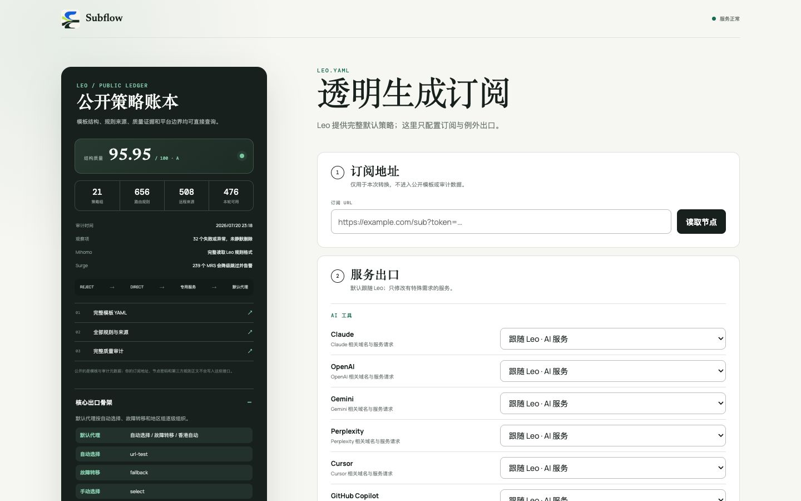
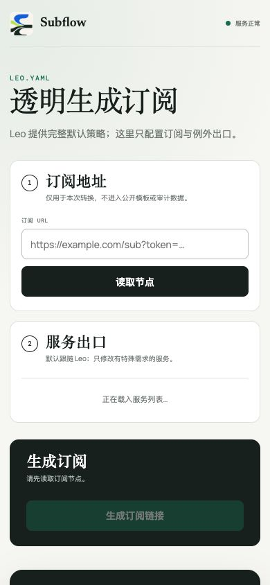

<p align="center">
  
</p>

# Subflow · Leo 策略订阅生成器

把一条已授权的 Clash/Mihomo 或 Surge 节点订阅，转换成基于 [`leo.yaml`](community_templates/leo/leo.yaml) 的 Clash/Mihomo 与 Surge 长期订阅。

页面只保留三件事：读取节点、按服务覆盖出口、生成订阅。模板结构、规则来源、质量审计和平台边界通过公开接口完整披露。

## 页面预览

### 桌面端：配置工作台与公开策略账本



### 移动端：先配置，后查证

<p align="center">
  
</p>

## 当前能力

| 能力 | 当前实现 |
|---|---|
| 基础模板 | 仅使用 `community_templates/leo/leo.yaml` |
| 输入格式 | Clash/Mihomo YAML；Surge `[Proxy]` 配置 |
| 服务出口 | 15 个服务可独立选择 Leo 策略组或订阅中的具体节点 |
| 输出目标 | 同时生成 Clash/Mihomo YAML 与 Surge CONF 订阅地址 |
| 地区节点组 | 根据节点名称动态生成；没有匹配节点的地区组会自动移除 |
| 规则优先级 | `REJECT → DIRECT → 专用服务 → 默认代理 → 兜底` |
| 质量审计 | 检查可用性、格式、内容重复、目标冲突和实际命中顺序 |
| 数据透明 | 原始模板、全部规则来源和完整审计报告均可通过 HTTP 查询 |

## 当前公开基线

下列数字来自受版本控制的 [`audit.json`](community_templates/leo/audit.json)，页面运行时不会写死这些值。

| 指标 | 当前值 |
|---|---:|
| 策略组 | 21 |
| 路由规则 | 656 |
| RuleProvider | 508 |
| 最近一轮可用来源 | 476 |
| 观察项 | 32 |
| 初步结构评分 | 95.95 / A |
| Surge 无法直接消费的 MRS 来源 | 239 |

结构评分仅衡量当前快照中的可用性、格式、重复和目标一致性，不代表长期新鲜度、服务覆盖率或语义绝对正确。

## 公开数据接口

服务启动或部署后，以下数据无需登录即可查询：

| 接口 | 内容 |
|---|---|
| [`/templates/source`](http://127.0.0.1:8000/templates/source) | 完整 `leo.yaml` 原文 |
| [`/community/rules`](http://127.0.0.1:8000/community/rules) | 全部顶层规则、RuleProvider 名称、URL、格式与来源路径 |
| [`/templates/audit`](http://127.0.0.1:8000/templates/audit) | 508 个来源的状态、摘要、重复组、冲突样本与质量评分 |
| [`/templates/detail`](http://127.0.0.1:8000/templates/detail) | 页面使用的模板摘要、策略组和公开数据入口 |
| [`/docs`](http://127.0.0.1:8000/docs) | FastAPI OpenAPI 文档 |

公开数据不包含：用户订阅地址、节点密码、Profile token 或第三方规则正文。审计报告只保存来源 URL、格式、哈希、数量和有限冲突样本。

## 快速启动

### Docker

```bash
docker compose up
```

### 本地开发

需要 Python 3.12+ 和 [uv](https://docs.astral.sh/uv/)。

```bash
uv sync
uv run uvicorn app.main:app --reload
```

打开 [http://127.0.0.1:8000](http://127.0.0.1:8000)。`/advanced` 是兼容入口，展示同一个页面。

## 使用流程

### 1. 读取节点

填入已授权的订阅 URL，点击“读取节点”。URL 仅用于当前转换和生成的 Profile，不会进入模板或公开审计数据。

### 2. 配置服务出口

默认情况下，所有服务沿用 Leo 策略：

| 分类 | 服务 |
|---|---|
| AI 工具 | Claude、OpenAI、Gemini、Perplexity、Cursor、GitHub Copilot |
| 开发服务 | GitHub、开发工具、Microsoft、Apple |
| 流媒体 | Netflix、YouTube、Disney+、Spotify、Telegram |

只有存在特殊需求时才覆盖出口。读取节点后，出口可以选择 Leo 策略组，也可以绑定一个具体节点。

### 3. 生成订阅

生成前会构建策略工作区并检查错误。成功后返回两个长期地址：

```text
/subscribe/<id>?token=…&target=clash
/subscribe/<id>?token=…&target=surge
```

Profile token 用于保护订阅和草稿接口，不会出现在公开模板、规则目录或审计报告中。

## Mihomo 与 Surge 边界

| 项目 | Mihomo | Surge |
|---|---|---|
| Leo YAML 语义 | 完整 | 编译为 Surge CONF |
| MRS RuleProvider | 支持 | 无文本映射时跳过并告警 |
| Mihomo 专属规则类型 | 支持 | 跳过并通过 warning 汇总 |
| 不支持的节点协议 | 按 Mihomo 能力输出 | 跳过并通过 warning 汇总 |

Surge 输出始终保留 `FINAL`，并过滤 Surge 不接受的 `DOMAIN-REGEX` 等规则。生成成功不等于两种客户端拥有完全相同的规则覆盖，应结合 `/templates/audit` 和响应 warning 判断。

## 更新公开审计

审计会访问 `leo.yaml` 中的全部远程 RuleProvider。确认网络环境允许后执行：

```bash
uv run python -m app.core.rule_source_audit --publish
```

该命令会：

1. 在 `.scratch/leo-rule-source-quality/reports/` 生成带时间戳的 JSON 与 Markdown 报告。
2. 更新 `community_templates/leo/audit.json`，供页面和 `/templates/audit` 使用。
3. 不下载或提交第三方规则正文。

不要因为单轮超时或 HTTP 403 自动删除来源。只有内容等价或多轮稳定失效的来源才适合进入安全清理流程。

## 项目结构

```text
app/
├── api/
│   └── convert.py               # 模板、公开审计、Profile 与订阅接口
├── core/
│   ├── template_engine.py       # Leo 模板加载、节点组物化与策略应用
│   ├── rule_source_audit.py     # 规则源审计、评分与安全去重
│   ├── policy_workspace.py      # 策略工作区 IR
│   ├── profiles.py              # Profile 持久化与目标缓存
│   └── platforms/               # Mihomo、Surge 等目标编译器
├── static/
│   ├── index.html               # 单页产品入口
│   ├── flow.js                  # 公开账本与订阅生成流程
│   └── flow.css                 # 桌面/移动响应式样式
community_templates/leo/
├── leo.yaml                     # 唯一基础策略模板
├── audit.json                   # 可公开查询的审计快照
└── README.md                    # 模板维护说明
```

完整目录说明见 [`DIRECTORY.md`](DIRECTORY.md)。

## 测试

```bash
uv run pytest
node --check app/static/flow.js
```

当前回归基线：`215 passed`。
