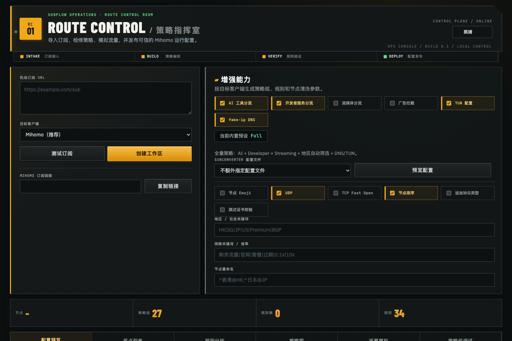

# Subflow · Route Control Room

Subflow 是一个面向 Mihomo 的可视化代理策略工作区。它将用户已授权的订阅源、策略模板和自定义分组合成 `PolicyWorkspace`，让配置在导出前可以被查看、分析、模拟和验证。

> 这不只是一个 YAML 生成器。Subflow 的产品中心是可理解、可检查、可编译的代理策略工作区。



## 能做什么

- 通过 [tindy2013/subconverter](https://github.com/tindy2013/subconverter) 将多种订阅格式归一化为 Clash YAML。
- 将订阅节点转换为统一的 `ProxyNode` IR，再与内置或社区模板合成 `PolicyWorkspace`。
- 查看节点、策略组、规则、RuleProvider 与内置目标之间的关系。
- 检测缺失 provider、缺失目标、重复规则、策略组环与不可达策略组。
- 输入域名或 IP，模拟规则命中与策略组解析路径。
- 编译并导出 Mihomo YAML。
- 创建持久化 Profile，获得不暴露原始订阅地址的 token 保护型短订阅 URL。
- 外部订阅或转换服务暂时失败时，回退到 Profile 最后一份成功产物。

Web 界面采用 **Route Control Room** 风格，将导入、编排、验证和发布收口到同一个操作台。

## 核心流程

```text
Subscription URL
      ↓ subconverter
Clash YAML
      ↓ parse + normalize
ProxyNode IR
      ↓ template + custom strategy
PolicyWorkspace
      ├─ analyze
      ├─ simulate
      ├─ visualize
      └─ compile
            ↓
        Mihomo YAML
```

## 能力成熟度

| 能力 | 状态 | 说明 |
|---|---|---|
| Mihomo / Clash 编译 | MVP 质量标准 | 主路径，统一经过 `PolicyWorkspace` |
| 规则分析 | MVP | 确定性结构检查 |
| 流量模拟 | MVP | 支持基础域名、IP 与 `MATCH`；`RULE-SET` / `GEOIP` 尚不做真实内容匹配 |
| 策略图 | MVP | 只读依赖视图 |
| 持久化 Profile | MVP | SQLite、token 授权、最后成功产物回退 |
| Surge | 实验性 | 不承诺与 Mihomo 的完整语义对等 |
| sing-box | 实验性 | 不承诺与 Mihomo 的完整语义对等 |

## 快速启动

### 环境要求

- Python 3.12+
- [uv](https://docs.astral.sh/uv/)
- Docker（用于运行 subconverter）

### 1. 安装依赖

```bash
uv sync
```

### 2. 启动 subconverter

```bash
docker run --rm --name subflow-subconverter \
  -p 25500:25500 \
  tindy2013/subconverter:latest
```

### 3. 启动 Subflow

```bash
uv run uvicorn app.main:app --reload
```

打开 [http://127.0.0.1:8000](http://127.0.0.1:8000)。

subconverter 不在默认地址时：

```bash
SUBCONVERTER_BASE_URL=http://127.0.0.1:25500 \
uv run uvicorn app.main:app --reload
```

## 基本使用

1. 输入你已获授权的订阅 URL。
2. 选择目标客户端与增强能力。
3. 配置节点过滤、重命名、Subconverter 模板或自定义策略组。
4. 创建 Workspace，检查规则分析、策略图和流量模拟。
5. 复制、下载或发布 Mihomo 配置。

## 配置模型

Subflow 将输入分为两层：

- **Subconverter 转换选项**：控制源订阅如何归一化，包括 `config`、`include`、`exclude`、`rename`、`emoji`、`udp`、`tfo`、`sort`、`append_type` 和 `scv` 等。
- **策略模板**：提供策略组、规则、RuleProvider、DNS 和 TUN 骨架。

两层输入先合成 `PolicyWorkspace`，再用于分析、模拟、可视化和 Mihomo 编译。

### 内置模板

| ID | 用途 |
|---|---|
| `minimal` | Proxy / Auto / Fallback / DIRECT 最小策略 |
| `developer` | GitHub、npm、Docker、JetBrains、Microsoft、Apple |
| `ai-tools` | Claude、OpenAI、Gemini、Perplexity、Cursor、GitHub Copilot |
| `streaming` | Netflix、YouTube、Disney、Spotify、Telegram |
| `full` | AI + Developer + Streaming + HK / SG / JP / US |
| `powerfullz` | 基于 powerfullz/override-rules 静态 YAML |

服务还会扫描 `community_templates/THEYAMLS/**/*.yaml`。社区模板 ID 以 `local:` 开头。`community_templates/Overwrite/` 中的 OpenClash 片段与 subconverter INI 不会被当作完整 Mihomo 模板自动加载。

## 持久化 Profile

临时 `/subscribe?...` 地址会携带原始订阅参数。需要长期使用时，建议创建 Profile：

```bash
curl -X POST http://127.0.0.1:8000/profiles \
  -H 'Content-Type: application/json' \
  -d '{
    "subscription_url": "https://example.com/sub",
    "template": "developer",
    "target": "mihomo"
  }'
```

响应示例：

```json
{
  "id": "<profile-id>",
  "token": "<access-token>",
  "subscribe_url": "/subscribe/<profile-id>?token=<access-token>"
}
```

- Profile 默认保存到 `data/subflow.db`。
- 使用 `SUBFLOW_DB_PATH` 可修改数据库路径。
- Profile ID 用于定位，token 用于授权；数据库中只保存 token 哈希。
- 数据库文件会设置为 `0600`，但其中的原始订阅 URL 未做应用层加密；请将数据库与备份视为敏感资产。
- 外部订阅、subconverter 或远程模板暂时失败时，会返回最后成功配置，并添加 `X-Subflow-Stale: true`。
- 认证失败、Profile 数据非法或内部编译错误不会静默回退。

## API 概览

| Method | Path | 用途 |
|---|---|---|
| `GET` | `/health` | 健康检查 |
| `GET` | `/templates` | 模板列表 |
| `GET` | `/templates/detail` | 模板详情与 YAML 预览 |
| `GET` | `/policy-catalog` | 本地策略目录 |
| `GET` | `/subconverter/targets` | 支持的输出目标 |
| `POST` | `/preview` | 预览归一化节点与配置树 |
| `POST` | `/convert` | 转换并编译配置 |
| `POST` | `/workspace/preview` | 创建 Workspace、策略图和分析结果 |
| `POST` | `/analyze` | 重新分析 Workspace |
| `POST` | `/simulate` | 模拟域名或 IP 的规则路径 |
| `POST` | `/compile/mihomo` | 将 Workspace 编译为 Mihomo YAML |
| `POST` | `/profiles` | 创建持久化 Mihomo Profile |
| `GET` | `/subscribe/{profile_id}` | 访问 token 保护的 Profile 订阅 |
| `GET` | `/subscribe` | 无持久化的直接订阅地址 |

FastAPI 交互文档可在运行时通过 [http://127.0.0.1:8000/docs](http://127.0.0.1:8000/docs) 查看。

## 安全边界

- 只处理调用方已获得访问权限的订阅；不绕过鉴权，不破解订阅内容。
- 只接受 `http` / `https` 订阅 URL。
- 拒绝 localhost、回环、私有网段、链路本地地址与其他非公网解析结果。
- 调用 subconverter 前会检查主机名与 DNS 解析结果。
- `/preview`、`/convert` 与直接 `/subscribe` 路径不主动持久化订阅数据。
- 只有用户显式创建的 Profile 会在 SQLite 中持久化原始订阅 URL、配置选项与最后成功产物。

Subflow 的 SSRF 防护不应被视为通用的多租户安全边界。当前更适合本地或受信任的单用户环境。

## 开发

运行测试：

```bash
uv run pytest
```

项目主要目录：

```text
app/api/                 HTTP 入口
app/core/                订阅、Workspace、分析、模拟与编译
app/core/platforms/      实验性平台编译器
app/models/              API 请求 / 响应模型
app/static/              Route Control Room Web UI
community_templates/     社区模板与上游素材
docs/                    PRD、ADR 与架构文档
tests/                   核心与 API 回归测试
```

## 设计与决策文档

- [Domain Context](CONTEXT.md)
- [Workspace-first Mihomo MVP ADR](docs/adr/0001-workspace-first-mihomo-mvp.md)
- [Persistent Profiles ADR](docs/adr/0002-persistent-profiles-and-stale-fallback.md)
- [Traffic Policy Control Plane MVP PRD](docs/prd/traffic-policy-control-plane-mvp.md)
- [Control Plane Roadmap](docs/architecture/control-plane-roadmap.md)

## 近期优先级

1. 为持久化 Profile 补齐页面管理与最后更新状态。
2. 增加 Mihomo golden-output 测试与更严格的兼容性验收。
3. 下载并缓存 RuleProvider 内容，让 `RULE-SET` 模拟与 provider 健康检查真正可用。
4. 增加 Workspace 版本、结构化 diff 与回滚。
5. 提供 Docker Compose 与可备份的持久化部署方案。

Surge、sing-box 和其他平台在达到 Mihomo 的 Workspace、Analyzer、Simulator 和 golden-output 语义要求前，仍保持实验性。
