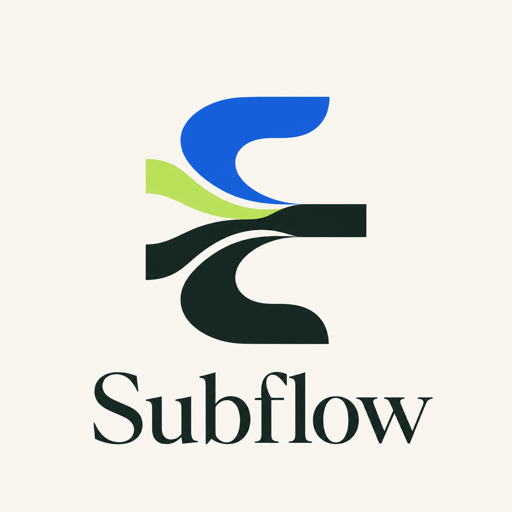
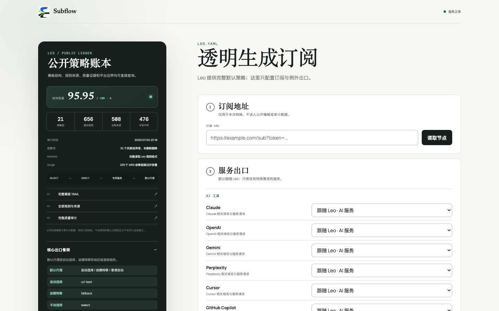
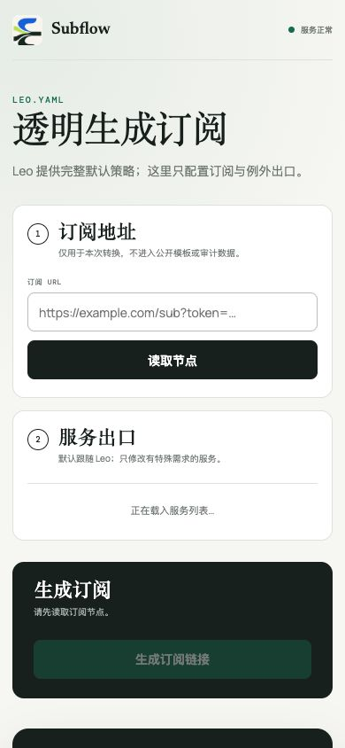

<p align="center">
  
</p>

# Subflow · Leo 策略订阅生成器

把一条已授权的 Clash/Mihomo 或 Surge 节点订阅，转换成基于 [`leo.yaml`](community_templates/leo/leo.yaml) 的 Clash/Mihomo 与 Surge 长期订阅。

页面只保留三件事：读取节点、按服务覆盖出口、生成订阅。模板结构、规则来源、质量审计和平台边界通过公开接口完整披露。

## 页面预览

### 桌面端：配置工作台与公开策略账本



### 移动端：先配置，后查证

<p align="center">
  
</p>

## 当前能力

| 能力 | 当前实现 |
|---|---|
| 基础模板 | 仅使用 `community_templates/leo/leo.yaml` |
| 输入格式 | Clash/Mihomo YAML；Surge `[Proxy]`；可选 Subconverter 兼容 Base64/URI 订阅 |
| 服务出口 | 15 个服务可独立选择 Leo 策略组或订阅中的具体节点 |
| 输出目标 | 同时生成 Clash/Mihomo YAML 与 Surge CONF 订阅地址 |
| 地区节点组 | 根据节点名称动态生成；没有匹配节点的地区组会自动移除 |
| 规则优先级 | `REJECT → DIRECT → 专用服务 → 默认代理 → 兜底` |
| 质量审计 | 检查可用性、格式、内容重复、目标冲突和实际命中顺序 |
| 数据透明 | 原始模板、全部规则来源和完整审计报告均可通过 HTTP 查询 |

## 当前公开基线

下列数字来自受版本控制的 [`audit.json`](community_templates/leo/audit.json)，页面运行时不会写死这些值。

| 指标 | 当前值 |
|---|---:|
| 策略组 | 21 |
| 路由规则 | 653 |
| RuleProvider | 508 |
| 最近一轮可用来源 | 476 |
| 观察项 | 32 |
| 初步结构评分 | 95.95 / A |
| Surge 无法直接消费的 MRS 来源 | 239 |

结构评分仅衡量当前快照中的可用性、格式、重复和目标一致性，不代表长期新鲜度、服务覆盖率或语义绝对正确。

## 公开数据接口

服务启动或部署后，以下数据无需登录即可查询：

| 接口 | 内容 |
|---|---|
| [`/templates/source`](http://127.0.0.1:8000/templates/source) | 完整 `leo.yaml` 原文 |
| [`/community/rules`](http://127.0.0.1:8000/community/rules) | 全部顶层规则、RuleProvider 名称、URL、格式与来源路径 |
| [`/templates/audit`](http://127.0.0.1:8000/templates/audit) | 508 个来源的状态、摘要、重复组、冲突样本与质量评分 |
| [`/templates/detail`](http://127.0.0.1:8000/templates/detail) | 页面使用的模板摘要、策略组和公开数据入口 |
| [`/docs`](http://127.0.0.1:8000/docs) | FastAPI OpenAPI 文档 |

公开数据不包含：用户订阅地址、节点密码、Profile token 或第三方规则正文。审计报告只保存来源 URL、格式、哈希、数量和有限冲突样本。

## 快速启动

### Docker

```bash
docker compose up --build -d
```

打开 <http://127.0.0.1:8000>。运行数据保存在宿主机的 `data/` 目录，应用源码不再挂载进容器。

如果机场只提供 Base64 或 `ss://`、`vmess://`、`trojan://` 等 URI 节点订阅，启用可选兼容层：

```bash
docker compose \
  -f docker-compose.yml \
  -f docker-compose.compatibility.yml \
  up --build -d
```

Subconverter 只在直接解析 Clash/Surge 失败时使用，并且只在 Compose 内部网络暴露。稳定部署建议用 `SUBCONVERTER_IMAGE` 固定已验证的 tag 或 digest，不要长期依赖 `latest`。

### 打包和离线导出镜像

脚本使用 Docker Buildx 分别构建可被 `docker load` 直接导入的 Linux x86_64 和 ARM64 镜像：

| 目标 | 打包命令 | 镜像标签 |
|---|---|---|
| x86_64 / amd64 | `./scripts/docker-build.sh amd64 1.0.0` | `subflow:1.0.0-amd64` |
| ARM64 / aarch64 | `./scripts/docker-build.sh arm64 1.0.0` | `subflow:1.0.0-arm64` |
| 两种架构 | `./scripts/docker-build.sh all 1.0.0` | 上述两个标签 |

导出压缩镜像包：

```bash
./scripts/docker-export.sh all 1.0.0
```

默认产物位于 `dist/docker/`：

```text
subflow-1.0.0-linux-amd64.tar.gz
subflow-1.0.0-linux-arm64.tar.gz
```

在目标机器导入并运行：

```bash
docker load < subflow-1.0.0-linux-amd64.tar.gz
docker run -d --name subflow \
  -p 8000:8000 \
  -v subflow-data:/app/data \
  subflow:1.0.0-amd64
```

自定义镜像仓库名称时，打包和导出必须使用相同的 `IMAGE_NAME`：

```bash
IMAGE_NAME=registry.example.com/leo/subflow ./scripts/docker-build.sh all 1.0.0
IMAGE_NAME=registry.example.com/leo/subflow ./scripts/docker-export.sh all 1.0.0
```

### 本地开发

需要 Python 3.12+ 和 [uv](https://docs.astral.sh/uv/)。

```bash
uv sync
uv run uvicorn app.main:app --reload
```

本地已有 Subconverter 服务时，可显式连接：

```bash
SUBFLOW_SUBCONVERTER_URL=http://127.0.0.1:25500 \
  uv run uvicorn app.main:app --reload
```

打开 [http://127.0.0.1:8000](http://127.0.0.1:8000)。`/advanced` 是兼容入口，展示同一个页面。

## 使用流程

### 1. 读取节点

填入已授权的订阅 URL，点击“读取节点”。URL 仅用于当前转换和生成的 Profile，不会进入模板或公开审计数据。

### 2. 配置服务出口

默认情况下，所有服务沿用 Leo 策略：

| 分类 | 服务 |
|---|---|
| AI 工具 | Claude、OpenAI、Gemini、Perplexity、Cursor、GitHub Copilot |
| 开发服务 | GitHub、开发工具、Microsoft、Apple |
| 流媒体 | Netflix、YouTube、Disney+、Spotify、Telegram |

只有存在特殊需求时才覆盖出口。读取节点后，出口可以选择 Leo 策略组，也可以绑定一个具体节点。

### 3. 生成订阅

生成前会构建策略工作区并检查错误。成功后返回两个长期地址：

```text
/subscribe/<id>?token=…&target=clash
/subscribe/<id>?token=…&target=surge
```

Profile token 用于保护订阅和草稿接口，不会出现在公开模板、规则目录或审计报告中。

### 4. 在其他设备上使用（OpenClash 等）

地址中的 host 来自你打开页面时的地址栏。如果你在 `http://127.0.0.1:8000` 上生成，复制到的地址对路由器无效——`127.0.0.1` 会指向路由器自己。页面会在这种情况下给出提示。

两种解决方式：

- 用本机局域网 IP 打开页面，例如 `http://192.168.1.10:8000`；
- 或固定对外地址：

```bash
SUBFLOW_PUBLIC_BASE_URL=http://192.168.1.10:8000
```

`leo.yaml` 有 288 个规则集托管在 `github.com` / `raw.githubusercontent.com`。生成 Clash/Mihomo 配置时，这些规则集会自动加上 `proxy: 自动选择`，通过节点下载；其余走 CDN 镜像的规则集保持直连。用 `SUBFLOW_PROVIDER_EGRESS` 可以改用别的策略组，设为 `DIRECT` 则关闭改写。

另外两点与客户端有关，生成时会作为 warning / info 提示：508 个规则集在冷启动时全部下载，性能受限的设备可能超时；239 个 `mrs` 规则集要求 Mihomo 内核 ≥ 1.18.0，旧版 Clash 内核会直接拒绝。

## Mihomo 与 Surge 边界

| 项目 | Mihomo | Surge |
|---|---|---|
| Leo YAML 语义 | 完整 | 编译为 Surge CONF |
| MRS RuleProvider | 支持 | 无文本映射时跳过并告警 |
| Mihomo 专属规则类型 | 支持 | 跳过并通过 warning 汇总 |
| 不支持的节点协议 | 按 Mihomo 能力输出 | 跳过并通过 warning 汇总 |

Surge 输出始终保留 `FINAL`，并过滤 Surge 不接受的 `DOMAIN-REGEX` 等规则。生成成功不等于两种客户端拥有完全相同的规则覆盖，应结合 `/templates/audit` 和响应 warning 判断。

## 更新公开审计

审计会访问 `leo.yaml` 中的全部远程 RuleProvider。确认网络环境允许后执行：

```bash
uv run python -m app.core.rule_source_audit --publish
```

该命令会：

1. 在 `.scratch/leo-rule-source-quality/reports/` 生成带时间戳的 JSON 与 Markdown 报告。
2. 更新 `community_templates/leo/audit.json`，供页面和 `/templates/audit` 使用。
3. 不下载或提交第三方规则正文。

不要因为单轮超时或 HTTP 403 自动删除来源。只有内容等价或多轮稳定失效的来源才适合进入安全清理流程。

## 项目结构

```text
app/
├── api/
│   └── convert.py               # 模板、公开审计、Profile 与订阅接口
├── core/
│   ├── template_engine.py       # Leo 模板加载、节点组物化与策略应用
│   ├── rule_source_audit.py     # 规则源审计、评分与安全去重
│   ├── policy_workspace.py      # 策略工作区 IR
│   ├── profiles.py              # Profile 持久化与目标缓存
│   └── platforms/               # Mihomo、Surge 等目标编译器
├── static/
│   ├── index.html               # 单页产品入口
│   ├── flow.js                  # 公开账本与订阅生成流程
│   └── flow.css                 # 桌面/移动响应式样式
community_templates/leo/
├── leo.yaml                     # 唯一基础策略模板
├── audit.json                   # 可公开查询的审计快照
└── README.md                    # 模板维护说明
```

完整目录说明见 [`DIRECTORY.md`](DIRECTORY.md)。

## 测试

```bash
uv run pytest
node --check app/static/flow.js
```

对真实机场订阅执行 OpenClash/Mihomo Docker 全链路验收：

```bash
SUBFLOW_E2E_SUBSCRIPTION_URL='https://example.com/your-authorized-subscription' \
  ./scripts/openclash-e2e.sh
```

该脚本会验证长期订阅能被独立容器拉取、配置能被 Mihomo 加载、至少一个节点通过测速，并通过生成配置实际访问 Google；订阅凭据和生成配置仅保存在权限为 `0700` 的临时目录，成功或失败后默认清理。

当前回归基线：`249 passed`。

参考实现对比、风险与后续架构候选见 [`docs/audits/subconverter-comparison.md`](docs/audits/subconverter-comparison.md)。
