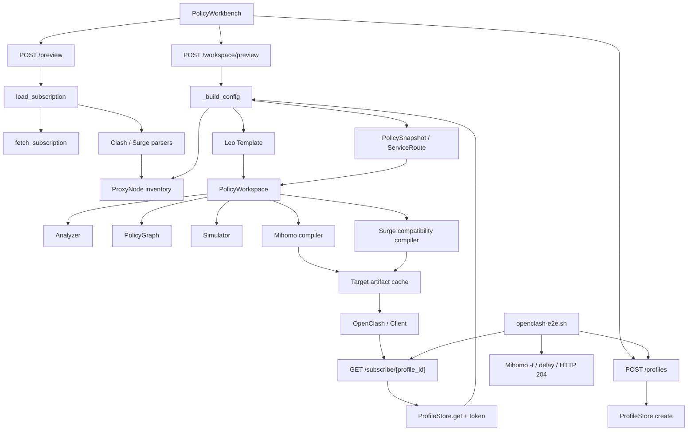

# Subflow 项目归档 — 2026-07-25

> 归档时间：2026-07-25（Asia/Shanghai）  
> 提交基线：`main@1433dc0`（与 `origin/main` 一致）  
> 快照性质：包含尚未提交的工作树能力；本文不是 Git tag、Release 或可回滚构建  
> 敏感信息：不包含真实订阅 URL、Profile token、节点凭据、生成配置或 SQLite 数据

## 1. 归档结论

Subflow 当前应被理解为一个面向高级个人用户的、自托管的**策略发布控制面**，而不是普通订阅格式转换器。

系统以唯一的 Leo Template 为策略基线，将授权订阅归一化为 `ProxyNode`，形成 `PolicyWorkspace`，完成结构分析、路由模拟和目标编译，再通过受 token 保护的 Profile Subscription URL 发布 Clash/Mihomo 与 Surge 产物。

当前工作树已经具备一条可运行、可自动验证的主链：

```text
授权订阅
  → ProxyNode inventory
  → Leo Template + PolicySnapshot / ServiceRoute
  → PolicyWorkspace
  → analyze / simulate / compile
  → Profile artifact cache
  → Subscription URL
  → OpenClash / Mihomo
```

归档时的质量信号：

| 信号 | 当前结果 |
|---|---:|
| 自动化测试 | 242 passed |
| 测试文件 | 25 |
| ADR | 10 |
| HTTP 入口 | 28（26 个 API + 2 个页面入口） |
| Leo ProxyGroup | 21 |
| Leo 顶层规则 | 653 |
| Leo RuleProvider | 508 |
| OpenClash/Mihomo Docker E2E | 通过 |
| E2E 可测速节点 | 111 |
| E2E 实际代理请求 | Google `generate_204` 返回 HTTP 204 |

## 2. 当前模块

当前模块：策略发布管线（Policy publication pipeline）

层级：Interface → Application → Domain → Infrastructure 的纵向切片

领域术语：`ProxyNode`、`RulePackSelection`、`PolicySnapshot`、`RouteIntent`、`PolicyWorkspace`、`Profile`、`Subscription URL`、`Release`

### 调用者

- `PolicyWorkbench` → 通过 `/preview`、`/workspace/preview`、`/profiles` → 目的：读取节点、验证策略并发布长期 Profile。
- OpenClash / Mihomo / Surge → 通过 `/subscribe/{profile_id}` → 目的：拉取目标客户端可消费的稳定策略产物。
- `scripts/openclash-e2e.sh` → 通过 Profile API、Subscription URL 和 Mihomo 控制接口 → 目的：验证“生成地址”在独立客户端边界上真实可用。

### 依赖

领域依赖：

- `app/ir.py` [Domain] → 提供 `ProxyNode`、`ProxyGroup`、`PolicyRule`、`RuleProvider`、`PolicyWorkspace` 及分析/模拟结果类型。
- `app/core/template_engine.py` [Domain] → 提供 Leo Template 加载、节点组物化和 `PolicySnapshot` 应用。
- `app/core/rule_packs.py`、`intent_compiler.py` [Domain] → 提供 RulePackSelection 与 RouteIntent 到完整策略图的编译。
- `app/core/policy_workspace.py` [Domain] → 提供配置与 PolicyWorkspace 的双向边界及 Mihomo 编译。
- `app/core/policy_analyzer.py`、`policy_graph.py`、`policy_simulator.py` [Domain] → 提供结构错误、运行可行性、关系图和路由追踪。
- `app/core/platforms/surge.py` [Domain] → 提供带显式降级 warning 的 Surge 兼容产物。

基础设施依赖：

- `app/core/fetcher.py` [Infrastructure] → 使用 HTTP、DNS 和 SSRF 防护拉取授权订阅。
- `app/core/profiles.py` [Infrastructure] → 使用 SQLite 持久化 Profile、token hash 和目标 artifact。
- `ruamel.yaml` [Infrastructure] → 解析和渲染 YAML。
- FastAPI / Pydantic [Infrastructure] → 暴露 HTTP Interface 并验证请求模型。
- Docker / Mihomo [Infrastructure] → 提供部署和 OpenClash 兼容运行验收。

### 模块深度

| 模块 | 公开接口 | 参数规模 | 深度 | 说明 |
|---|---:|---:|---|---|
| `subscription.py` | 1 | 1 | Deep | 一个 URL 隐藏获取、Clash/Surge 识别、解析、归一化和错误翻译。 |
| `template_engine.py` | 4 | 0–4 | Deep | 隐藏唯一模板约束、节点选择器展开、地区组物化、策略 merge/replace。 |
| `policy_workspace.py` | 6 | 1–3 | Deep | 隐藏规则解析、IR 构建、序列化、Provider 出口和 Mihomo 编译。 |
| `ProfileStore` | 5 | 0–3 | Deep | 隐藏 token 校验、Schema 初始化/迁移、artifact 隔离和更新失效。 |
| `platforms/surge.py` | 1 | 4 | Deep | 一个编译入口隐藏协议、策略组、规则类型和 MRS 兼容处理。 |
| `api/convert.py` | 21 个路由 | legacy `/subscribe` 为 9 个查询参数 | Mixed | 深度编排和兼容入口集中在同一文件，Interface 面偏宽。 |
| `renderer.py` | 1 | 1 | Shallow | 仅封装 YAML 序列化参数，但维持统一输出格式。 |

穿透方法：

- `_profile_template()` 始终返回唯一 Leo Template，只保留兼容形状。
- `_target_media_type()`、`_target_filename()` 是轻量目标映射。
- `/advanced` 与 `/` 当前都只返回同一个 PolicyWorkbench 页面。

## 3. 系统地图



依赖方向保持为：

```text
Interface
  app/static + app/api
        ↓
Application orchestration
  convert.py + Profile publication flow
        ↓
Domain
  intent / rule packs / template / workspace / analyzer / compilers
        ↓
Infrastructure
  HTTP + DNS + SQLite + filesystem + YAML + Docker/Mihomo
```

## 4. 关键运行链

### 4.1 订阅预览

```text
POST /preview
  → load_subscription(url)
  → fetch_subscription(url)
  → parse_clash_yaml_full() 或 parse_surge_nodes()
  → clash_to_ir()
  → normalize_nodes()
  → ProxyNode list + config tree
```

关键不变量：节点连接所需字段必须穿过 `ProxyNode.extra`、TLS 和 Transport IR 后无损输出。

### 4.2 策略验证

```text
POST /workspace/preview
  → _resolve_product_request()
  → RulePackSelection / RouteIntent
  → _build_config()
  → apply_template()
  → config_to_workspace()
  → analyze_workspace()
  → build_policy_graph()
```

发布阻断项包括缺失 RuleProvider、缺失目标、空策略组和 NodeSelector 空匹配；运行可行性问题以 warning/info 暴露。

### 4.3 Profile 发布与订阅

```text
POST /profiles
  → ConvertRequest validation
  → ProfileStore.create()
  → profile id + independent token

GET /subscribe/{profile_id}
  → ProfileStore.get(id, token)
  → live rebuild
  → target compiler
  → save_artifact()
  → config response
```

外部订阅或模板依赖失败时可以返回最后一次成功 artifact，并通过 `X-Subflow-Stale: true` 标记；认证失败、请求损坏或内部编译错误不静默回退。

### 4.4 OpenClash/Mihomo 运行验收

```text
真实上游订阅
  → 创建 Profile
  → 独立 Docker 容器拉取 Subscription URL
  → Mihomo -t
  → 启动 Mihomo
  → 自动选择组真实测速
  → 通过 mixed-port 请求 Google generate_204
```

该验收已证明转换后的 Subscription URL、YAML、节点字段、策略组和实际代理路径在 Mihomo v1.19.29 上可运行。

## 5. 当前能力边界

| 能力 | 状态 | 边界 |
|---|---|---|
| Clash/Mihomo | 质量基线 | 完整 Leo 语义；使用 PolicyWorkspace 编译。 |
| Surge | 公共兼容目标 | 跳过不支持协议、规则类型和无文本映射的 MRS，并返回 warning。 |
| sing-box | 实验性内部路径 | Leo 产品接口拒绝将其作为正式目标。 |
| Profile | 已持久化 | SQLite 中保存源订阅意图、token hash 和目标 artifact。 |
| ProfileRevision | 仅领域定义 | 尚无独立持久化模型。 |
| Release | 仅领域定义 | 尚无不可变 provenance、版本历史和 rollback 实现。 |
| RuleSource 审计 | 已有公开快照 | 单轮可用性不等于长期新鲜度或语义正确性。 |
| 多租户 / 公共 SaaS | 明确不支持 | 当前是单个高级用户的私有部署。 |

## 6. 架构摩擦

- `app/api/convert.py` 为 709 行、21 个路由，兼具产品请求归一化、模板元数据、编译编排、Profile 生命周期和 legacy 查询参数解析；Application 边界清楚，但 Interface 聚合过宽。
- 领域文档已定义 `ProfileRevision`、不可变 `Release`、provenance 和 rollback，当前代码只有可变 Profile 与最后成功 artifact；领域模型领先于实现。
- ADR 0006 设想把协议广度交给成熟转换边界，当前运行路径仍由本地 Clash/Surge parser 承担；“兼容边界”尚未成为可替换模块。
- ADR 0009/0010 将 RulePackSelection 定义为默认产品装配边界；当前页面加载 RulePack 元数据，但主路径仍以完整 Leo 为默认，仅生成服务出口覆盖，产品语义存在漂移。
- 唯一 Leo Template 包含 508 个 RuleProvider。结构与运行验收通过，但 OpenClash 冷启动会产生大量下载和短暂不可用窗口，资源较小的路由器风险更高。
- `_render_output()` 和 workspace 编译仍保留 sing-box 分支，但 Leo-backed Interface 明确拒绝该目标；实验代码和产品边界并存。
- `renderer.py`、目标文件名/媒体类型映射等为浅模块，当前成本很低，但如果继续增加目标会形成分散的目标能力判断。

## 7. 决策状态

| ADR | 状态 | 当前含义 |
|---|---|---|
| 0001 | superseded | PolicyWorkspace 仍是内部核心，但不再是页面导航模型。 |
| 0002 | accepted | Profile token、SQLite 和 stale artifact 语义已实现。 |
| 0003 | superseded | 多目标 Profile 保留，内置 Claude RulePack 方案被替代。 |
| 0004 | accepted | Claude 变更保持模板结构，不注入应用自有域名集。 |
| 0005 | superseded | 四步向导被单页 PolicyWorkbench 替代。 |
| 0006 | accepted | 产品定位为策略发布控制面，而非协议转换器。 |
| 0007 | accepted | 唯一 Canonical Base + PolicySnapshot 组合。 |
| 0008 | superseded | RouteIntent 退为选中 RulePack 的可选出口覆盖。 |
| 0009 | accepted | RulePackSelection 是默认策略装配边界。 |
| 0010 | accepted | 单页 PolicyWorkbench 是当前交互决策。 |

## 8. 工作树快照

提交基线仍是：

```text
1433dc0 fixed: test case
```

当前工作树包含尚未提交的能力增量，主要集中在：

- Docker 镜像构建、离线导出与 Compose 部署；
- Profile 对外地址和 OpenClash 可达性提示；
- RuleProvider 出口策略和运行可行性分析；
- Surge 兼容处理；
- OpenClash/Mihomo 真实 E2E；
- 对应 README、CONTEXT 和测试更新。

这些变更不应被视为已发布版本。恢复工作时必须先执行 `git status` 并检查当前 diff，不能假设 `main@1433dc0` 已包含本归档描述的全部能力。

## 9. 验证与恢复入口

基础验证：

```bash
uv run pytest
node --check app/static/flow.js
git diff --check
```

本地部署：

```bash
docker compose up --build -d
```

真实 OpenClash/Mihomo 验收：

```bash
SUBFLOW_E2E_SUBSCRIPTION_URL='https://example.com/authorized-subscription' \
  ./scripts/openclash-e2e.sh
```

恢复上下文的最小阅读顺序：

1. `CONTEXT.md`
2. 本归档
3. ADR 0006、0009、0010
4. `app/api/convert.py`
5. `app/core/subscription.py`
6. `app/core/template_engine.py`
7. `app/core/policy_workspace.py`
8. `app/core/profiles.py`

## 10. 下一阶段入口

本归档不做重构，只记录后续决策入口：

1. 决定先实现真正的 `ProfileRevision / Release / rollback`，还是先收敛 `convert.py` 的 Application 边界。
2. 对齐 RulePackSelection 的领域决策与 PolicyWorkbench 当前交互。
3. 明确本地 parser 与“可替换协议兼容边界”的长期关系。
4. 为资源受限 OpenClash 设备定义 RuleProvider 冷启动预算或轻量策略包。
5. 为 Mihomo 质量基线建立固定内核版本的持续 E2E，而不是只依赖可变的 `latest` 镜像。

